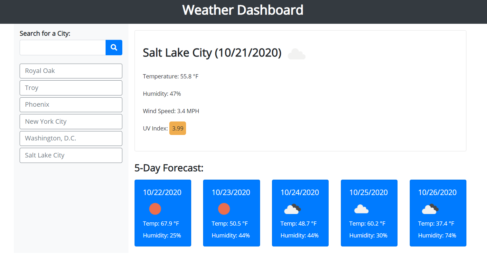

# weather-dashboard

## Summary 
This webpage accepts a city name as input in a search field, stores the city name in local storage, then displays both current weather data and five-day forecast data for the city. Stored city names are displayed as buttons under the search field; once clicked, weather data for that city is displayed again.

Weather data is retrieved from the openweathermap.org APIs using AJAX and HTTP GET requests .

## Installation
To download this code to your own machine, enter the following in your command line:

`https://github.com/EmilyAH-01/weather-dashboard.git`

## Usage
Navigate into your cloned project directory and open index.html in a browser. 

## Deployed Application
https://emilyah-01.github.io/weather-dashboard

## Future Development
Create additional search fields so that a state and/or country can be specified for each city search.

